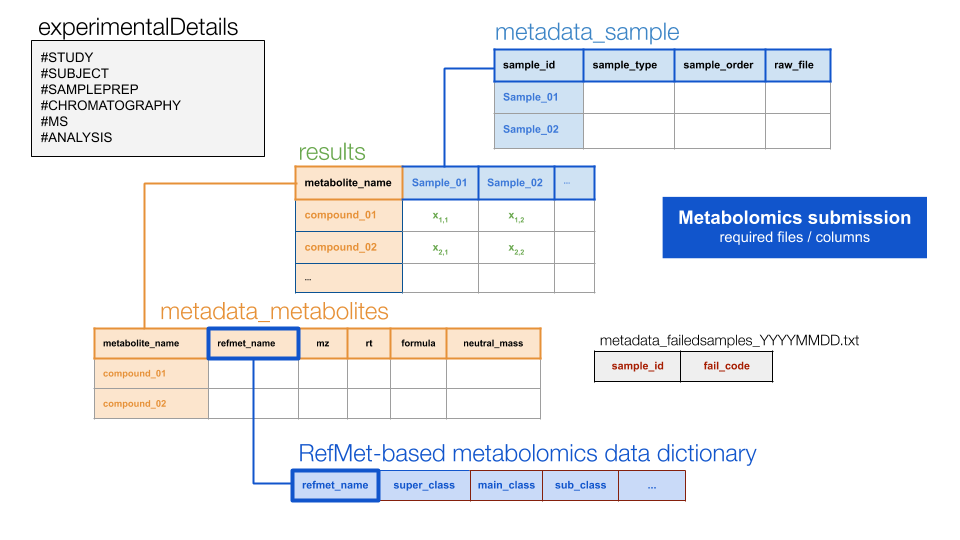

```{r, include = FALSE}
knitr::opts_chunk$set(
  collapse = TRUE,
  comment = "#>"
)
```


# Installation

First, download and install R and RStudio:

- [R](https://mirror.las.iastate.edu/CRAN/) 
- [RStudio](https://rstudio.com/products/rstudio/download/) (free version)

Then, open RStudio and install the `devtools` package

```{r eval = FALSE}
install.packages("devtools")
```

Finally, install the `MotrpacBicQC` package

```{r eval = FALSE}
library(devtools)
devtools::install_github("MoTrPAC/MotrpacBicQC", build_vignettes = TRUE)
```


# Usage

Load the library

```{r setup}
library(MotrpacBicQC)
```

And run any of the following tests to check that the package 
is correctly installed and it works. For example:

```{r eval = FALSE}
# Just copy and paste in the RStudio terminal

check_metadata_metabolites(df = metadata_metabolites_named, name_id = "named")
check_metadata_samples(df = metadata_sample_named, cas = "umichigan")
check_results(r_m = results_named, m_s = metadata_sample_named, m_m = metadata_metabolites_named)
```

which should generate the following output:

```{r eval = TRUE}
check_metadata_metabolites(df = metadata_metabolites_named, name_id = "named")
check_metadata_samples(df = metadata_sample_named, cas = "umichigan")
check_results(r_m = results_named, m_s = metadata_sample_named, m_m = metadata_metabolites_named)
```

## How to test your datasets

Two approaches available:

### Check full `PROCESSED_YYYYMMDD` folder (recommended)

Run test on the full submission. For that, run the following command:

```{r eval = FALSE}
validate_metabolomics(input_results_folder = "/full/path/to/PROCESSED_YYYYMMDD", 
                      cas = "your_site_code")
```

**cas** is one of the followings:

- "broad_met" = Broad Metabolomics
- "emory"     = Emory
- "mayo"      = Mayo Clinic
- "umichigan" = Umichigan
- "gtech"     = Georgia Tech
- "duke"      = Duke

### Check individual files

- Check metadata metabolites:

```{r eval = FALSE}
# Open the metadata_metabolites file(s)

metadata_metabolites_named <- read.delim(file = "/path/to/your/file", stringsAsFactors = FALSE)
metadata_metabolites_unnamed <- read.delim(file = "/path/to/your/file", stringsAsFactors = FALSE)

check_metadata_metabolites(df = metadata_metabolites_named, name_id = "named")
check_metadata_metabolites(df = metadata_metabolites_unnamed, name_id = "unnamed")

```

- Check metadata samples:

```{r eval = FALSE}
# Open your files
metadata_sample_named <- read.delim(file = "/path/to/your/file", stringsAsFactors = FALSE)
metadata_sample_unnamed <- read.delim(file = "/path/to/your/file", stringsAsFactors = FALSE)

check_metadata_samples(df = metadata_sample_named, cas = "your_side_id")
check_metadata_samples(df = metadata_sample_unnamed, cas = "your_side_id")
```

- Check results, which needs both both metadata metabolites and samples

```{r eval = FALSE}
# Open your files
metadata_metabolites_named <- read.delim(file = "/path/to/your/file", stringsAsFactors = FALSE)
metadata_sample_named <- read.delim(file = "/path/to/your/file", stringsAsFactors = FALSE)
results_named <- read.delim(file = "/path/to/your/file", stringsAsFactors = FALSE)

check_results(r_m = results_named, 
              m_s = metadata_sample_named, 
              m_m = metadata_metabolites_named)
```

## Merge metabolomics data (only PASS1A supported)

The following functions enable merging all results and metadata files into a 
single data frame. 

The folder/file structure of a required untargeted metabolomics submission is as follows:

```
PASS1A-06/
  T55/
   HILICPOS/ 
    BATCH1_20190725/ 
     RAW/
      Manifest.txt
      file1.raw
      file2.raw
      etc
    PROCESSED_20190725/
     metadata_failedsamples_[cas_specific_labeling]. txt
     NAMED/
        results_metabolites_named_[cas_specific_labeling].txt 
        metadata_metabolites_named_[cas_specific_labeling].txt
        metadata_sample_named_[cas_specific_labeling].txt
        metadata_experimentalDetails_named_[cas_specific_labeling].txt
     UNNAMED/
        results_metabolites_unnamed_[cas_specific_labeling].txt
        metadata_metabolites_unnamed_[cas_specific_labeling].txt
        metadata_sample_unnamed_[cas_specific_labeling].txt
        metadata_experimentalDetails_unnamed_[cas_specific_labeling].txt
```

With the following file relations...



To merge all data available in a `PROCESSED_YYYYMMDD` folder, run the following command:

```{r, eval=FALSE}
t31_ionpneg <- combine_metabolomics_batch(input_results_folder = "/full/path/to/PROCESSED_YYYYMMDD/", 
                                          cas = "umichigan")
```

Alternatively, each individual dataset can also be provided. For example:

```{r, eval=FALSE}
plasma.untargeted.merged <- 
  merge_all_metabolomics(m_m_n = metadata_metabolites_named,
                         m_m_u = metadata_metabolites_unnamed,
                         m_s_n = metadata_sample_named,
                         r_n = results_named,
                         r_u = results_unnamed,
                         phase = "PASS1A-06")
```

Check the function help for details

# Help

Additional details for each function can be found by typing, for example:

```{r eval=FALSE}
?merge_all_metabolomics
```

Need extra help? Please, [submit an issue here](https://github.com/MoTrPAC/MotrpacBicQC/issues) 
providing as many details as possible.

# Credit

[MoTrPAC Bioinformatics Center](https://motrpac-data.org/)
